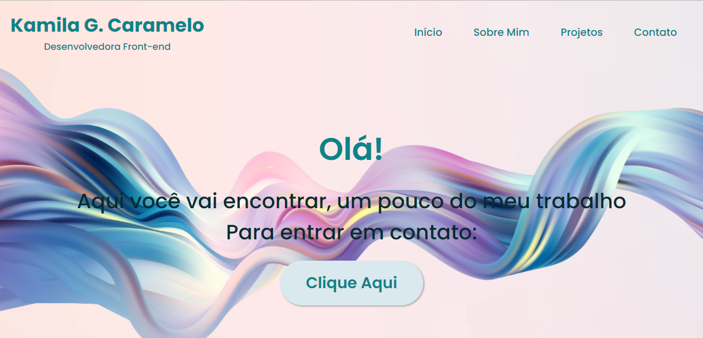
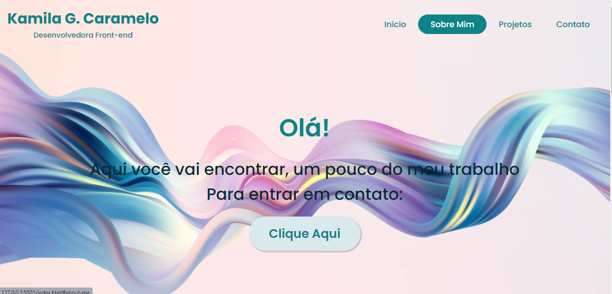
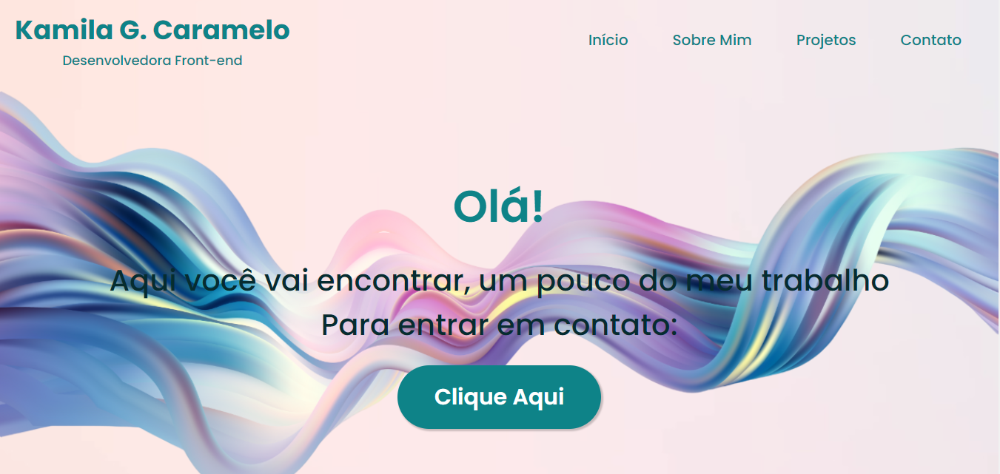
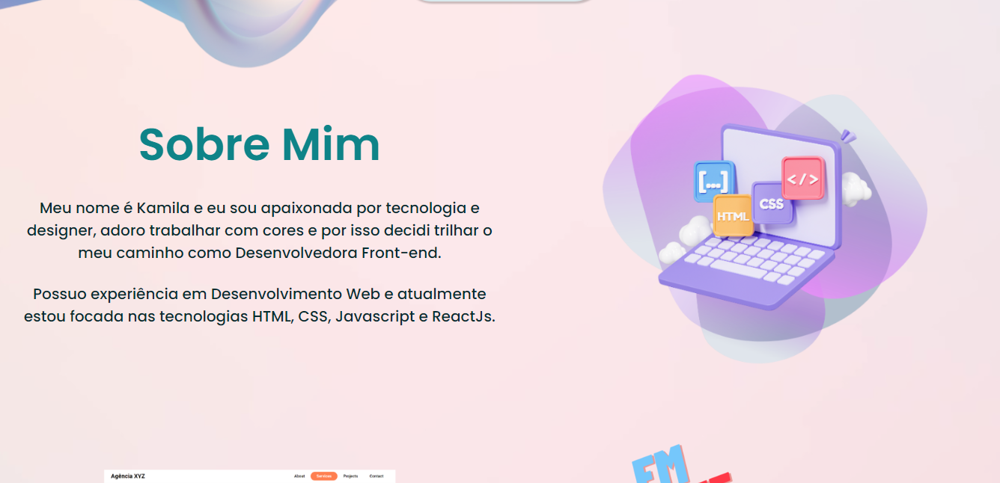
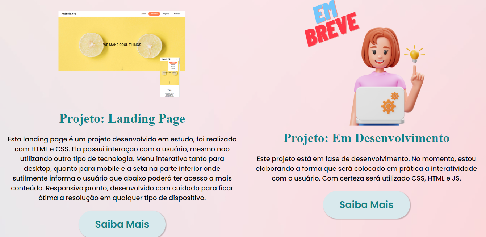
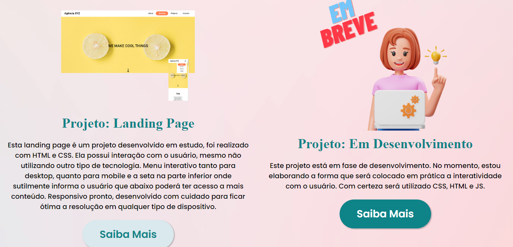
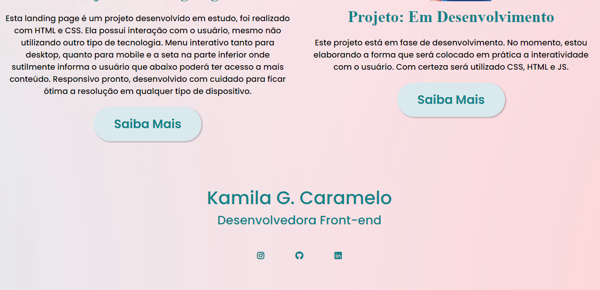
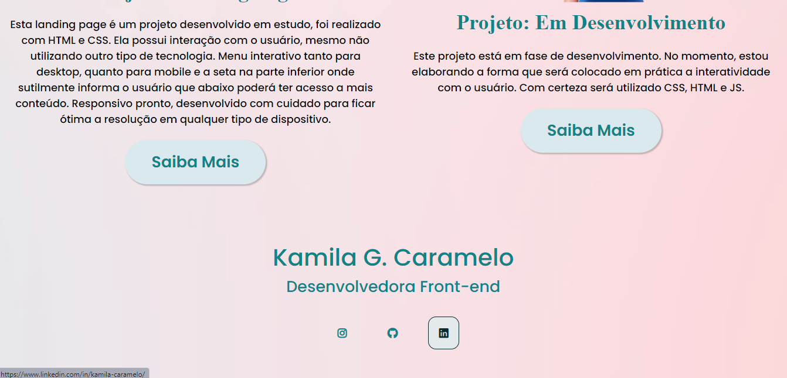

# Projeto: Portfólio

Este projeto tem por objetivo apresentar os projetos desenvolvido totalmente ou parcialmente por mim.

De forma que transmita informação e ao mesmo tempo não seja maçante, que tenha uma certa interação com o usuário para que o mesmo fique preso em cada detalhe.

## Desafio
O maior desafio foi criar tudo do zero, definir o designer com cores, imagens, fontes e tantos detalhes. Depois disso escolhi usar o GRID E FLEX para demonstrar o conhecimento adquirido sobre essa tecnologia. 

## Linguagem Utilizada
O projeto foi desenvolvido em HTML e CSS, porém já estou estudando possibilidades de aplicar JS e React JS que estou estudando no momento.

## Designer 
O Designer do projeto foi realizado com ajuda do Canva, Color Hunt, Google Fonts e Font Awesome.

## Futuro
Como disse anteriormente continuo estudando e pretendo aplicar JS e React Js no projeto. 
Desenvolver a parte responsiva de modo que além de melhorar o desempenho em dispositivos de diferentes tamanhos, possa ficar mais agradável aos olhos. 

## Imagens

Imagem Desktop 01
[
    
]

Imagem Desktop 02
[
    
]

Imagem Desktop 03
[
    
]

Imagem Desktop 04
[
    
]

Imagem Desktop 05
[
    
]

Imagem Desktop 06
[
    
]

Imagem Desktop 07
[
    
]

Imagem Desktop 08
[
    
]

